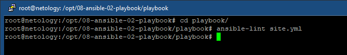
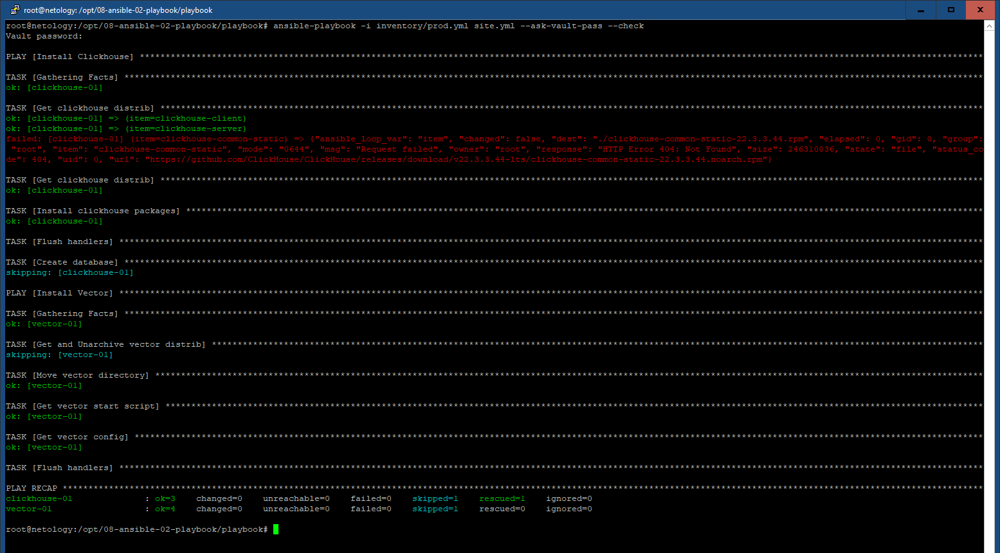
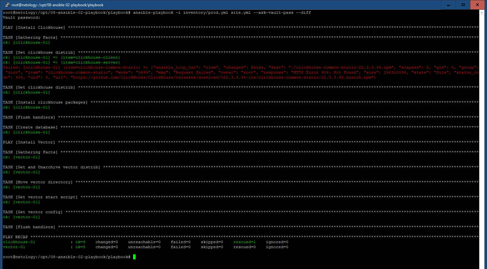
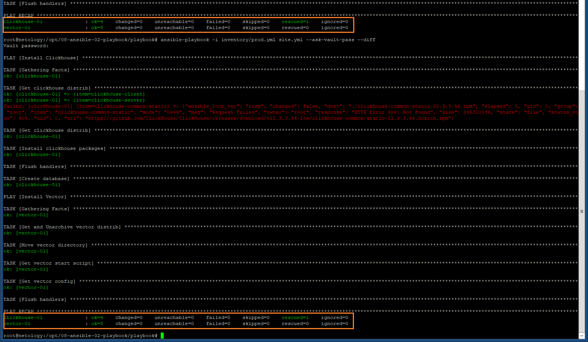

# 08-ansible-02-playbook

## Подготовка

В задании участвуют два предварительно подготовленных контейнера из образа Centos8 и установеленными
сервером SSH, а также утилиты Daemonize, которая понадобится в дальнейшем для запуска Vector в виде
самостоятельного процесса. Один контейнер предназначен для развертывания ClickHouse, второй - Vector.
Запуск контейнеров:

``` bash
docker run -d --rm --network bridge --name centos1 -e ROOT_PASSWORD=********* centos8-ssh-dem
docker run -d --rm --network bridge --name centos2 -e ROOT_PASSWORD=********* centos8-ssh-dem
```

## Основная часть

Находим IP контейнеров:

``` bash
docker network inspect bridge | grep -E "Name|IPv4"
```

и заполняем в ./playbook/inventory/prod.yml ими соответствующие значения ansible_host для clickhouse и vector.
Проверяем корректность заполнения ansible_port (по умоляанию 22/ssh), а такще имя пользователя ssh c правами root и
пароль (зашифрован паролем из предыдущего задания):

``` yml
clickhouse:
  hosts:
    clickhouse-01:
      ansible_host: 172.17.0.2
      ansible_port: 22
      ansible_user: root
      ansible_password: !vault |
          $ANSIBLE_VAULT;1.1;AES256
          32376230386337393363366437343039656565303835633732366162313437363935636462626633
          3536656135383039356161323232353064383066303538330a373235343838393837326661633261
          38383732326333386638666636663431363336363462343966393833613234646434383730633730
          3138393235386438360a313966393639366136666230336666323133663263656432613162326436
          6562
vector:
  hosts:
    vector-01:
      ansible_host: 172.17.0.3
      ansible_port: 22
      ansible_user: root
      ansible_password: !vault |
          $ANSIBLE_VAULT;1.1;AES256
          32376230386337393363366437343039656565303835633732366162313437363935636462626633
          3536656135383039356161323232353064383066303538330a373235343838393837326661633261
          38383732326333386638666636663431363336363462343966393833613234646434383730633730
          3138393235386438360a313966393639366136666230336666323133663263656432613162326436
          6562
```

Переменные vars.yaml из Group_vars состоят из групп: Clickhouse и Vector  и содержат информацию о приложениях, версиях и платформах
для установки:

clickhouse:

``` ansible
clickhouse_version: "22.3.3.44"
clickhouse_packages:
  - clickhouse-client
  - clickhouse-server
  - clickhouse-common-static
```

vector:

``` ansible
vector_version: "0.44.0"
vector_platform: "x86_64"
vector_directory: "/opt"
vector_clickhouse_ip: "172.17.0.2"
```

Playbook site.yml состоит из 2-х play: Install Clickhouse и Install Vector.

Install Clickhouse взят из примера задания, но источники загрузки дистрибутивов по причине их недоступности изменены 
на https://github.com/ClickHouse/ClickHouse/releases/download

Install Vector состоит из task:

- Загрузка, распаковка дистрибутива Vector:

``` ansible
    - name: Get and Unarchive vector distrib
      become: true
      ansible.builtin.unarchive:
        remote_src: yes
        src: "https://packages.timber.io/vector/{{ vector_version }}/vector-{{ vector_version }}-{{ vector_platform }}-unknown-linux-gnu.tar.gz"
        dest: "{{ vector_directory }}"
    - name: Move vector directory
      become: true
      command: "mv {{ vector_directory }}/vector-{{ vector_platform }}-unknown-linux-gnu {{ vector_directory }}/vector"
      args:
        creates: "{{ vector_directory }}/vector"
```

- Создания скрипта запуска Vector в качестве самостоятельного процесса, а также конфигурации.

``` ansible
    - name: Get vector start script
      template:
        src=./roles/vector/templates/vector-sh.yaml
        dest="{{ vector_directory }}/vector/vector.sh"
    - name: Get vector config
      vars:
        clickhouse_ip: "{{ vector_clickhouse_ip }}"
      template:
        src=./roles/vector/templates/vector.yaml
        dest="{{ vector_directory }}/vector/config/vector.yaml"
      notify: Start vector service
      tags:
        - restart_vector
```

, используются templates vector.yaml:

```
sources:
  parse_syslog:
    type: "demo_logs"
    format: "syslog"
    interval: 1

transforms:
  parse_logs:
    type: "remap"
    inputs: ["parse_syslog"]
    source: |
      . = parse_syslog!(string!(.message))

sinks:
  syslogs_clickhouse_output:
    type: clickhouse
    inputs: ["parse_syslog"]
    database: syslog
    endpoint: 'http://{{ clickhouse_ip }}:8123'
    table: logs
    encoding:
      timestamp_format: unix
    batch:
      timeout_secs: 10
```

, vector-sh.yaml:

``` bash
#!/bin/bash

/usr/bin/pkill vector
/usr/sbin/daemonize /opt/vector/bin/vector --config /opt/vector/config/vector.yaml
```

Определен TAG "restart_vector", с которым можно отдельно запускать playbook для быстрого перезапуска
процесса vector, к примеру, после изменения конфигурации.

Проверка на ошибки. Ошибок нет:

``` bash
ansible-lint site.yml
```


С флагом --check

``` bash
ansible-playbook -i inventory/prod.yml site.yml --ask-vault-pass --check
```


С флагом --diff

``` bash
ansible-playbook -i inventory/prod.yml site.yml --ask-vault-pass --diff
```


Playbook идемпотентен:



